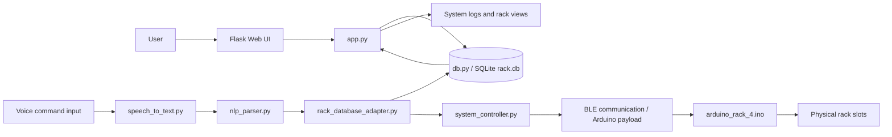

# Project Block Diagram

This is a simple high-level flow of the project structure, excluding the wake word and motion sensor paths.

## Short Flow Summary

1. The Flask app serves the UI and reads/writes rack data from SQLite.
2. Voice commands go through speech-to-text, then NLP parsing.
3. The parsed request looks up inventory/location data in the database.
4. The controller converts the result into BLE payloads for the Arduino rack.
5. The Arduino updates the physical rack slots.

